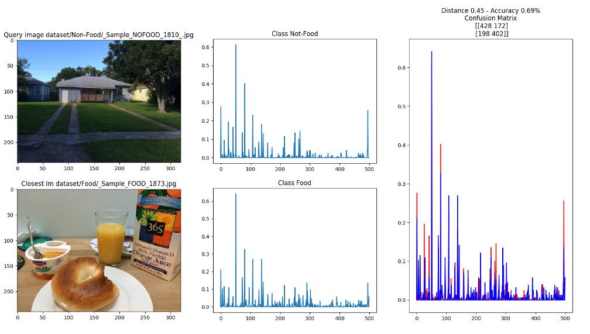

# Food-Classification
This _Social Media Management_ project allow to classificate picture between food and non-food.
####What we do:
1. Extract feature splitted 70% for training and 30% test set.
2. With deasy (step=8) extract local feature.
3. To build aur dictionary of visual word, we have cluster all local feature with KMeans=500 (scikitlearn).
4. Finally to classificate the picture we have used KNN.

##Bag of visual word
>In computer vision, the bag-of-words model (BoW model) can be applied to image classification, by treating image features as words. In document classification, a bag of words is a sparse vector of occurrence counts of words; that is, a sparse histogram over the vocabulary. In computer vision, a bag of visual words is a vector of occurrence counts of a vocabulary of local image features.

###Set enviroment
You need to have install on your system:
- [Python2.7](http://www.python.it/) 
- [Skimage](http://scikit-image.org/)
- [Numpy](http://www.numpy.org/)
- [Matplotlib](http://matplotlib.org/)

###How to use
To use this script you need to clone this repo and download from release the **dataset.7z** file.
Extract the file in the same folder of the repo and extract _dataset/Food.7z_ & _dataset/Non-Food.7z_.
Launch _main.py_ and enojy the classificator.

###References
Original dataset:
- [Food Dataset](http://iplab.dmi.unict.it/madima2015/UNICT-FlickrFood.rar)
- [Non-Food Dataset](http://iplab.dmi.unict.it/madima2015/UNICT-FlickrNon-Food.rar)

Inspired by http://iplab.dmi.unict.it/madima2015 
